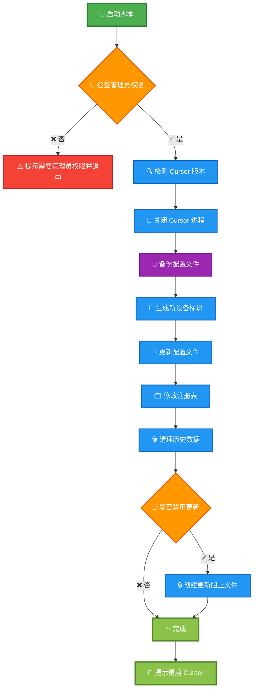
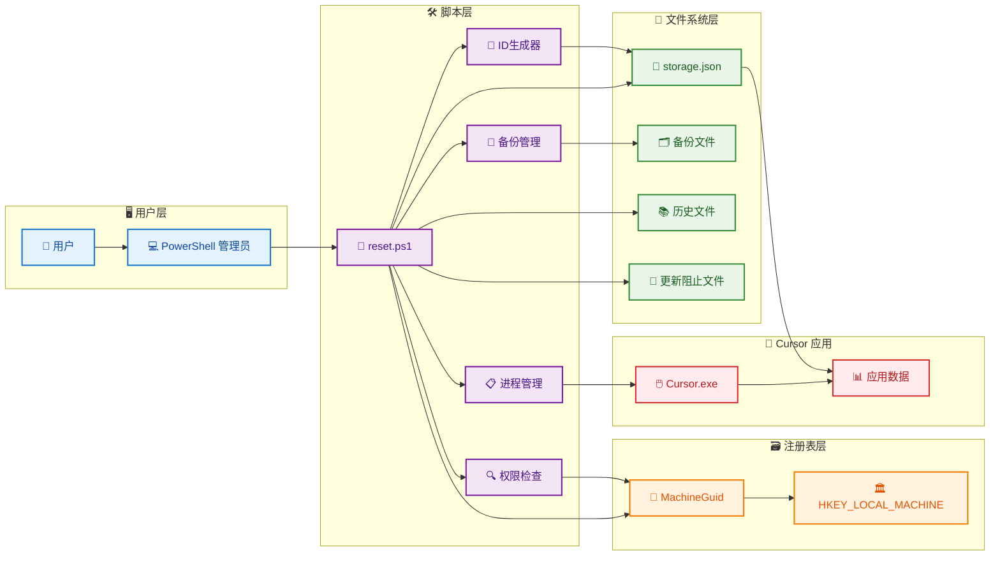

# Cursor 设备指纹修改工具

一个用于重置 Cursor 编辑器设备标识的 PowerShell 脚本工具。

## 🚀 快速使用

### 运行要求

- Windows 系统
- 管理员权限（必须）
- 已安装 Cursor

### 使用方法

**1. 以管理员身份打开 PowerShell**

- 按 `Win + X` → 选择"Windows PowerShell (管理员)"

**2. 执行命令**

```powershell
# 在线运行（推荐）
irm https://raw.githubusercontent.com/Huo-zai-feng-lang-li/cursor-free-vip/main/reset.ps1 | iex

# 或下载后运行
irm https://raw.githubusercontent.com/Huo-zai-feng-lang-li/cursor-free-vip/main/reset.ps1 -OutFile reset.ps1
.\reset.ps1

# 或本地运行（如果已克隆项目）
cd "项目目录路径"
.\reset.ps1
```

**3. 按提示操作**

- 脚本自动关闭 Cursor 进程
- 选择是否禁用自动更新
- 完成后重启 Cursor

### 功能说明

- 🔄 重置设备标识符
- 🗂️ 修改系统注册表
- 🗑️ 清理使用历史
- 🛡️ 自动备份配置
- 🚫 可选禁用更新

## ⚠️ 注意事项

### 风险提示

- 会修改系统注册表，需管理员权限
- 会清理 Cursor 使用历史和工作区数据
- 可能违反软件使用协议，请自行评估风险
- 部分杀毒软件可能误报

### 使用建议

- 使用前备份重要配置和项目文件
- 建议先在测试环境验证效果

## 📊 执行流程



## 🏗️ 系统架构



## 🔧 技术原理

### 修改内容

- **配置文件**: `%APPDATA%\Cursor\User\globalStorage\storage.json`
- **注册表**: `HKEY_LOCAL_MACHINE\SOFTWARE\Microsoft\Cryptography\MachineGuid`
- **清理目录**: History、workspaceStorage、state.vscdb 等
- **更新控制**: 创建 `%LOCALAPPDATA%\cursor-updater` 阻止文件

### 设备标识符

- `machineId`: auth0|user\_ + 随机十六进制
- `macMachineId`: 标准 UUID v4 格式
- `devDeviceId`: .NET GUID
- `sqmId`: 大写 GUID 格式

## 📄 免责声明

**本工具仅供学习和技术研究使用**

- 使用者需自行承担所有风险（系统损坏、数据丢失等）
- 可能违反软件使用协议，请自行评估法律风险
- 作者不承担任何直接或间接损失责任
- 仅限个人学习研究，禁止商业用途
- 不得用于绕过软件正当授权

### 技术支持

- 问题反馈：提交 Issue
- 交流学习：关注公众号【彩色之外】

---

**⚠️ 继续使用即表示您已理解并同意承担相应风险**
