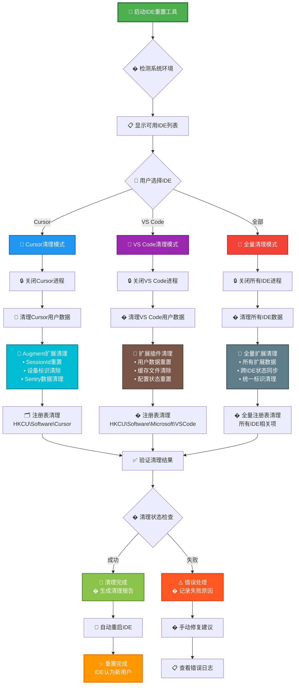
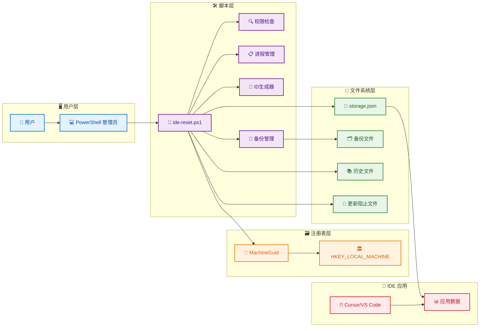

# IDE 通用重置工具

一个支持多 IDE（Cursor/VS Code）和扩展插件清理的 PowerShell 脚本工具，可以重置设
备标识并清理扩展数据让其认为是新用户。

## 🚀 快速使用

### 运行要求

- Windows 系统
- 管理员权限（必须）
- 已安装目标 IDE（Cursor 或 VS Code）

### 🎯 使用方式

#### 🚀 一键运行（推荐）

```powershell
# 以管理员身份运行 PowerShell，然后执行：
irm https://raw.githubusercontent.com/Huo-zai-feng-lang-li/cursor-free-vip/main/ide-reset-ultimate.ps1 | iex
```

**✨ 特性：**

- 🎯 **多 IDE 支持**：Cursor + VS Code
- 🧩 **智能扩展清理**：Augment 深度风控清理 + 其他扩展
- 🎨 **颜色兼容**：自动适配所有 PowerShell 环境
- 🔍 **干运行模式**：预览操作不实际执行
- 🚀 **自动重启**：完成后可选择自动重启 IDE
- 🛡️ **保留配置**：用户设置和偏好完全保留

#### 🔧 本地运行

```powershell
# 下载
irm https://raw.githubusercontent.com/Huo-zai-feng-lang-li/cursor-free-vip/main/ide-reset-ultimate.ps1 -OutFile ide-reset-ultimate.ps1
.\ide-reset-ultimate.ps1

# 或克隆整个项目
git clone https://github.com/Huo-zai-feng-lang-li/cursor-free-vip.git
cd cursor-free-vip
.\ide-reset-ultimate.ps1
```

### 🚀 功能特性

- 🎯 **多 IDE 支持**: Cursor + VS Code
- 🧩 **扩展清理**: Augment、GitHub Copilot、Codeium 等
- 🔍 **干运行模式**: 预览操作不实际执行
- 🛡️ **智能备份**: 自动备份重要配置
- 🔄 **设备重置**: 生成新的设备标识符
- 🗂️ **注册表修改**: 更新系统 MachineGuid
- 🗑️ **历史清理**: 清理使用历史但保留用户配置
- 🚫 **更新控制**: 可选禁用自动更新（Cursor）
- 🌐 **网络清理**: 可选 DNS 缓存和网络协议栈重置
- 🚀 **自动重启**: 完成重置后可选择自动重启 IDE
- 🎨 **颜色兼容**: 自动检测终端支持，兼容各种 PowerShell 环境

## ⚠️ 注意事项

### 风险提示

- 会修改系统注册表，需管理员权限
- 会清理 IDE 使用历史和工作区数据
- 会清理扩展插件数据（让扩展认为是新用户）
- 可能违反软件使用协议，请自行评估风险
- 部分杀毒软件可能误报

### 使用建议

- **预览操作**：首次使用建议选择干运行模式查看将要执行的操作
- **备份数据**：使用前备份重要配置和项目文件
- **测试环境**：建议先在测试环境验证效果

## 📊 详细清理过程



### 🧹 清理过程详解

#### 1. 历史数据清理（保留用户配置）

- **state.vscdb** - IDE 状态数据库，存储扩展状态和用户活动记录
- **History 目录** - 最近打开的文件和项目历史记录
- **workspaceStorage** - 工作区级别的扩展数据和设置
- **logs 目录** - IDE 运行日志和错误记录

#### 2. 扩展数据清理（让扩展认为是新用户）

- **Augment 扩展** - `globalStorage\augmentcode.augment\*` **深度风控清理**
  - 🎯 **SessionID 重置**：设备唯一标识、永久安装 ID、设备指纹
  - 🔄 **环境跟踪清除**：系统环境变量、硬件信息、网络配置
  - 📊 **监控数据删除**：Sentry 监控、性能指标、用户行为分析
  - 🗑️ **Git 信息清理**：仓库数据、分支信息、提交历史摘要
  - 🛡️ **保留配置**：用户设置、偏好、快捷键、主题、代码片段
  - 📍 **适用范围**：Cursor + VS Code，基于源码分析的精准清理
- **GitHub Copilot** - `globalStorage\github.copilot\*` **完全清理**
  - 登录状态和令牌
  - 使用历史和建议记录
  - 个性化配置
- **Codeium** - `globalStorage\codeium.codeium\*` **完全清理**
  - 账户绑定信息
  - API 使用记录
  - 用户偏好数据

#### 3. 保留的数据（不会被清理）

- **settings.json** - 用户个人设置和偏好
- **keybindings.json** - 自定义键盘快捷键
- **snippets** - 用户自定义代码片段
- **themes** - 主题和颜色配置
- **extensions** - 已安装的扩展程序本体

## 🏗️ 系统架构



## 📁 项目文件

```
cursor-free-vip/
├── README.md                 # 项目说明文档
└── ide-reset-ultimate.ps1    # 🌟 （唯一文件）
```

### 🎯 文件说明

- **`ide-reset-ultimate.ps1`** - 🌟 **（强烈推荐）**

  - 🎯 **多 IDE 支持**：Cursor + VS Code
  - 🧩 **智能扩展清理**：Augment 深度风控清理 + 其他扩展
  - 🎨 **颜色兼容**：自动适配所有 PowerShell 环境，无颜色显示问题
  - � **干运行模式**：预览操作不实际执行
  - � **自动重启**：完成后可选择自动重启 IDE
  - 🛡️ **保留配置**：用户设置和偏好完全保留
  - 🎯 **Augment 深度清理**：基于源码分析的风控机制清理
  - ✨ **一个文件解决所有问题**

## 🔧 技术原理

### 支持的 IDE 和路径

#### Cursor

- **配置文件**: `%APPDATA%\Cursor\User\globalStorage\storage.json`
- **用户数据**: `%APPDATA%\Cursor\User`
- **更新控制**: `%LOCALAPPDATA%\cursor-updater`

#### VS Code

- **配置文件**: `%APPDATA%\Code\User\globalStorage\storage.json`
- **用户数据**: `%APPDATA%\Code\User`

### 清理内容

#### 历史数据清理（保留用户配置）

- `globalStorage\state.vscdb` - 状态数据库
- `History\*` - 使用历史记录
- `workspaceStorage\*` - 工作区存储
- `logs\*` - 日志文件

#### 扩展数据清理（让扩展认为是新用户）

- **Augment 扩展** - `globalStorage\augmentcode.augment\*` **深度风控清理**
  - 🎯 **SessionID 机制**：清理设备唯一标识、永久安装 ID、UUID 持久化
  - 🔄 **SystemEnvironment**：清除系统环境变量、OS 信息、硬件配置
  - 📊 **SentryMetadataCollector**：删除监控数据、性能指标、内存统计
  - 🗑️ **Git 跟踪信息**：清理仓库根目录、分支信息、提交历史、远程 URL
  - 🛡️ **保留配置**：用户设置、偏好、快捷键、主题、代码片段
  - 📍 **基于源码分析**：针对 Augment 风控机制的精准清理策略
- **GitHub Copilot** - `globalStorage\github.copilot\*` **完全清理**
- **Codeium** - `globalStorage\codeium.codeium\*` **完全清理**

#### 数据库操作策略

- **state.vscdb** - 完全删除重建，重置所有扩展状态
- **扩展状态重置** - 让所有扩展重新初始化
- **用户配置保护** - 不影响 IDE 核心设置文件

#### Augment 风控机制深度解析

基于对 Augment 插件源码的分析，发现其采用多层风控机制：

**🎯 SessionId 类风控**

- `PermanentInstallationID.get()` - IntelliJ 永久安装 ID
- `generateAndStoreUUID()` - 备用 UUID 生成和持久化
- 设备唯一标识跟踪

**🔄 SystemEnvironment 类收集机制**

收集方式：

```java
public Map<String, String> getenv();     // 获取系统环境变量
public String getProperty(String key);   // 获取系统属性
```

收集的信息：

- **系统信息**：`os.name`, `os.version`, `os.arch` (操作系统指纹)
- **Java 环境**：`java.version`, `java.vendor`, `java.home` (运行时环境)
- **用户信息**：`user.name`, `user.home`, `user.dir` (用户目录指纹)
- **硬件信息**：CPU 架构、内存大小、显卡信息 (硬件指纹)
- **IDE 信息**：版本号、构建信息、插件列表 (软件环境)
- **网络配置**：IP 地址、MAC 地址、网络适配器 (网络指纹)

**📊 SentryMetadataCollector 监控机制**

监控方式：

```java
private Object collectSystemTags();      // 收集系统标签
private MemoryMetrics collectMemoryMetrics(); // 内存指标
private Object collectRepositoryMetrics(); // 仓库指标
public Object countGitTrackedFiles();    // Git文件统计
```

监控的数据：

- **系统标签**：OS 类型、版本、架构、IDE 版本 (系统指纹组合)
- **内存指标**：堆内存使用、GC 统计、垃圾回收频率 (性能指纹)
- **性能数据**：接口响应时间、错误次数、崩溃记录 (行为指纹)
- **用户行为**：按键频率、命令使用、功能偏好 (使用模式)
- **Git 信息**：仓库根目录、当前分支、提交历史、文件变更 (项目指纹)
- **项目数据**：文件数量、代码行数、语言分布 (代码指纹)

**🗑️ 让扩展认为是新用户的清理策略**

**🎯 SessionID 重置**

- 清理 `permanentId.json` (PermanentInstallationID 缓存)
- 删除 `uuid.json` (generateAndStoreUUID 持久化数据)
- 重置 `sessionId.json` 和 `deviceId.json`
- **效果**：扩展无法识别之前的设备标识

**🔄 SystemEnvironment 缓存清理**

- 删除 `systemEnv.json` (getenv()缓存)
- 清理 `systemProps.json` (getProperty()缓存)
- 移除 `osInfo.json`, `javaInfo.json`, `userInfo.json`
- 清除 `hardwareInfo.json`, `ideInfo.json`, `networkInfo.json`
- **效果**：强制扩展重新收集环境信息，但无法关联到历史数据

**📊 SentryMetadataCollector 数据清理**

- 删除 `sentry/` 监控目录和所有子文件
- 清理 `systemTags.json` (collectSystemTags()结果)
- 移除 `memoryMetrics.json` (collectMemoryMetrics()数据)
- 清除 `repositoryMetrics.json` (collectRepositoryMetrics()统计)
- 删除 `gitTrackedFiles.json` (countGitTrackedFiles()记录)
- **效果**：清空所有行为分析和性能监控历史

**🧹 深度缓存清理**

- 模式匹配清理：`*.env`, `*.cache`, `*.fingerprint`, `*.metrics`
- 前缀清理：`system_*`, `env_*`, `hardware_*`, `network_*`
- 数据库清理：包含环境信息的 `*.db`, `*.sqlite` 文件
- **效果**：确保没有遗留的环境指纹缓存

**🛡️ 保留用户配置**

- 保留 `settings.json`, `preferences.json`, `config.json`
- 保留 `keybindings.json`, `themes.json`, `snippets.json`
- **效果**：用户的个人设置和偏好完全不受影响

#### 网络清理策略（可选）

- **DNS 缓存刷新** - `ipconfig /flushdns` 清理 DNS 解析缓存
- **Winsock 重置** - `netsh winsock reset` 重置网络套接字
- **TCP/IP 重置** - `netsh int ip reset` 重置网络协议栈
- **说明**：这些操作有助于清理网络层面的设备指纹，但需要重启生效

### 设备标识符生成

- `machineId`: auth0|user\_ + 随机十六进制
- `macMachineId`: 标准 UUID v4 格式
- `devDeviceId`: .NET GUID
- `sqmId`: 大写 GUID 格式

### 注册表修改

- **路径**: `HKEY_LOCAL_MACHINE\SOFTWARE\Microsoft\Cryptography\MachineGuid`
- **作用**: 系统级设备标识，影响所有应用程序的设备识别

## 📄 免责声明

**本工具仅供学习和技术研究使用**

- 使用者需自行承担所有风险（系统损坏、数据丢失等）
- 可能违反软件使用协议，请自行评估法律风险
- 作者不承担任何直接或间接损失责任
- 仅限个人学习研究，禁止商业用途
- 不得用于绕过软件正当授权

### 技术支持

- 问题反馈：提交 Issue
- 交流学习：关注公众号【彩色之外】

---

**⚠️ 继续使用即表示您已理解并同意承担相应风险**
